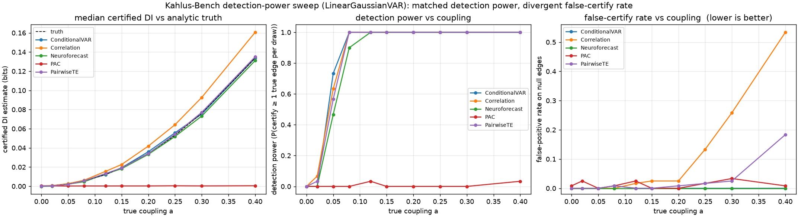

# KAHLUS-BENCH

> A leakage-sealed benchmark for neural-coupling and forecastability claims.

Kahlus-Bench scores every neural-coupling estimator — correlation, phase-
amplitude coupling, transfer entropy, directed-information estimators (DINE),
foundation models — **the same certified way**, on synthetic ground-truth
systems whose true directed information is analytically known.

The benchmark's purpose is to expose, quantitatively, the measurement crisis the
field has been quietly accumulating:

  * **Pairwise methods blindly certify confounded edges.** On the
    `ConfounderVAR` scenario, where two streams are driven by a common driver
    and have *zero* direct edge, ordinary Pearson correlation false-certifies
    **95%** of the null edges (n=30 draws, 4096 samples, seed 0). Pairwise
    lagged transfer entropy false-certifies **44%**. A conditional estimator
    that conditions on the rest certifies **0%**.
  * **Pairwise methods confuse mediation for direct coupling.** On the
    `MediatedVAR` X → Z → Y chain, pairwise correlation certifies the mediated
    X → Y edge as direct **100%** of the time. Conditional VAR certifies it as
    mediated, *not* direct.
  * **The field has never had a metric for this.** Every paper reports
    precision-on-real-data, nobody reports the false-certify rate under a
    confounder or the mediated-false-edge rate. Kahlus-Bench makes both
    first-class metrics.

This is a **standard**, not a discovery: a sealed, pre-registered benchmark
whose scorecard a method cannot game without lying about its own lower bound.
The model is CASP for protein structure — a fixed, adversarial benchmark the
whole field agrees to be measured against. The ground-truth analog is a
synthetic suite whose true directed information is closed-form, so "correct"
is not a matter of opinion. The field has coupling estimators but no agreed
way to certify them; this is that missing layer.

The formal pre-registration (frozen scoring rules) is in
[PRE_REGISTRATION.md](PRE_REGISTRATION.md).

---

## Install / run

The package is pure Python (numpy only). Run from this repository:

```sh
python -m kahlus_bench.run --n-draws 30 --n-samples 4096
```

Output is a one-line-per-method scorecard (values shown for the pinned
`--n-draws 30 --n-samples 4096` seed-0 configuration):

```
method               scenario                       P     R  nullCert  medFalse  floorBias
Correlation          LinearGaussianVAR@a=0.05      1.00  0.38     0.000     0.000    -0.0021
Correlation          ConfounderVAR                 0.34  1.00     0.950     0.000    -0.2409
PairwiseTE           ConfounderVAR                 0.53  1.00     0.442     0.000    -0.2409
ConditionalVAR       ConfounderVAR                 1.00  1.00     0.000     0.000    -0.2409
Neuroforecast        ConfounderVAR                 1.00  1.00     0.000     0.000    -0.2409
Correlation          MediatedVAR                   0.43  1.00     0.556     1.000    -0.1812
ConditionalVAR       MediatedVAR                   1.00  1.00     0.000     0.000    -0.1812
```

(`Neuroforecast` rows appear when the `neuroforecast` package is importable;
see [Adding your estimator](#adding-your-estimator).)

Read the columns as:

  * `P / R` — precision and recall on the **certified** edge set (LCB clears
    the noise floor).
  * `nullCert` — fraction of true-zero edges the method falsely certified.
    **The r=0.97 metric.**
  * `medFalse` — fraction of mediated edges the method falsely certified as
    direct. The direct-vs-mediated assay.
  * `floorBias` — method's claimed detection floor minus the trusted analytic
    detection floor, in bits. Positive means the method over-claims its own
    power (the inflation that pervades the literature).

## Methods already shipped

  * `CorrelationMethod` — pairwise Pearson (max of lag-0 and lag-1), with a
    cluster-bootstrap LCB converted to bits via the Gaussian mutual information
    formula.
  * `PairwiseTransferEntropyMethod` — pairwise lag-1 Gaussian transfer entropy.
  * `PhaseAmplitudeCouplingMethod` — phase-of-slow vs envelope-of-fast PAC,
    using a Hilbert transform via FFT (no scipy dependency). A stand-in for the
    correlational analyses Rao et al. flag as "precluding inference about
    directionality."
  * `ConditionalVARMethod` — conditional linear-Gaussian VAR(1). The
    direct-vs-mediated-aware baseline and the lightweight proxy for
    neuroforecast's certified estimator.

## Detection-power sweep

The headline result. `kahlus_bench.sweep` runs every method across a graded
coupling grid (`a` from 0 to 0.4, 30 draws × 4096 samples per point) and
records, per method per coupling strength, the detection power on true edges
and the false-positive rate on null edges. This separates the two things the
field routinely conflates: *can you see the real edge* and *do you invent fake
ones at the same time*.



The one row that summarizes the whole benchmark — at `a=0.3`, a clearly
detectable coupling where every non-degenerate method has detection power 1.0:

| method | detection power | false-positive rate on null edges |
| --- | --- | --- |
| Correlation | 1.00 | **0.258** |
| PairwiseTE | 1.00 | 0.025 |
| ConditionalVAR | 1.00 | **0.000** |
| Neuroforecast | 1.00 | **0.000** |

Pearson correlation pays for its detection power with a 26% false-certify rate
on edges that carry zero directed information. A conditional estimator gets the
same detection power for free. That gap is the measurement problem, quantified.

Reproduce (writes `outputs/sweep_results.csv`, `sweep_summary.csv`,
`sweep_run_meta.json`, and the figure):

```sh
python -m kahlus_bench.sweep \
  --n-draws 30 --n-samples 4096 --seed 0 --out kahlus_bench/outputs
```

The committed CSVs are bit-for-bit reproducible from this command (the
`Neuroforecast` rows require the [neuroforecast](https://github.com/ptlnextdoor/neuroforecast)
package on `PYTHONPATH`).

## Adding your estimator

Implement the `Method` protocol: a pure callable taking one
`ObservableDraw` and returning a `MethodReport` of per-edge `EdgeReport`s in
bits. Methods never see ground truth; the `SealedScorer` is the only object
that does.

```python
from kahlus_bench import EdgeReport, MethodReport, Method, ObservableDraw

class MyEstimator:
    name = "MyMethod"
    def __call__(self, draw: ObservableDraw) -> MethodReport:
        # ... compute edges ...
        return MethodReport(
            edges={ (i, j): EdgeReport(cdi_bits=..., lcb95_bits=...,
                                      direct_fraction=...) },
            claimed_floor_bits=...,
        )
```

Then drop it into `kahlus_bench.run._make_methods` (or your own runner) and
the scorer does the rest.

## Pre-registration

The benchmark's scoring rules are frozen in [PRE_REGISTRATION.md](PRE_REGISTRATION.md). The point of a
benchmark is that its rules do not move to flatter a method, including ours.

## Authorship and ethics

Kahlus-Bench is honest about what it is. It does not certify a method as
"good" or "bad"; it reports the exact rate at which a method false-certifies
under confounding and mediation. A method that lights up more often is not
necessarily wrong; it is wrong *when its LCB clears the noise floor on a true
null edge*. The benchmark exists to make that the standard the field reports,
not a footnote.
